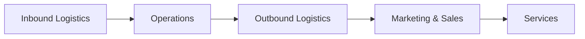
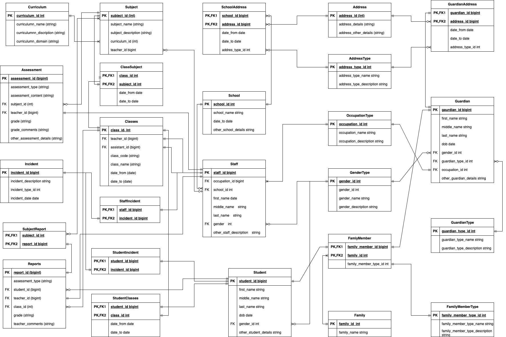

# Little People’s Architecture Vision: 

 

<b>Introduction:</b> This section introduces the purpose, scope, context, and stakeholders of the document. It explains why Little People needs an enterprise architecture vision and how it will benefit from it. 

## 1. Introduction
This document outlines our vision for the future state of our enterprise architecture, using TOGAF methodologies. Our goal is to develop a holistic approach to achieve our business strategy, improve business processes and information, and reduce IT costs. We have chosen ArchiMate as our enterprise architecture modeling language because of its portability, flexibility, documentation, and community support. In this document, we will describe our current state, future state, and transition plan for our enterprise architecture. We hope that this document will provide a clear and consistent view of our architecture vision and ultimately help us achieve our goals. 

### 1.1. Purpose of the document
The purpose of this document is to present Little People’s architecture vision, which is a high-level description of the desired future state of our enterprise architecture. This document will explain how Little People plans to use ArchiMate, a portable and flexible framework for enterprise architecture modeling, to support their business strategy and address their challenges. This document will also provide a detailed overview of Little People’s current state, future state, and transition plan for their enterprise architecture, following the TOGAF methodology. This document is intended for the following audiences:

- **Management and staff of Little People**: Authorised personell responsible for providing high-quality care and education to young children.
- **Parents/guadians of Little People’s children**: Authorised personell interested in the communication and collaboration with Little People regarding the care and education of their children.
- **IT professionals and consultants**:  Authorised personell involved in the design, implementation, and governance of Little People’s enterprise architecture.
- **Regulators and auditors**: Authorised personell who need to ensure that Little People complies with the relevant standards and regulations.

This document will help these audiences understand the vision, goals, benefits, and roadmap of Little People’s enterprise architecture. It will also help them communicate and collaborate effectively with each other and with external stakeholders. This document will serve as a guide and a reference for the ongoing development and management of Little People’s enterprise architecture.

### 1.2. Scope and context
The scope of this document is to present Little People’s architecture vision, which is a high-level description of the desired future state of their enterprise architecture. This document will cover the key components and relationships of Little People’s enterprise architecture, including their business processes, information systems, and technology infrastructure. It will also describe how Little People plans to use ArchiMate, a portable and flexible framework for enterprise architecture modeling, to support their business strategy and address their challenges.

The context of this document is Little People’s current situation and challenges. Little People is a child care organization with 10 schools that provide care and education to young children. The organization is committed to providing high-quality care and education, but it is facing some challenges. One challenge is that it has a lot of administrative tasks that take up a lot of time and resources. Another challenge is that it wants to improve the communication with parents and the learning experience for children. Adopting an Enterprise Architecture allowed Little People to develop relevant processes, analysis, and documentation to ensure the alignment of information systems to their business goals and objectives. This allowed them to develop a holistic approach to achieve their business strategy, improve business processes and information, and reduce IT costs.
### 1.3. Stakeholders and concerns
The stakeholders of Little People’s enterprise architecture are the individuals or groups who have an interest or influence in the organization’s architecture. They include the following:

- **Management and Staff**: The management and staff of Little People are responsible for providing high-quality care and education to young children. They are concerned about the efficiency and effectiveness of their business processes, the quality and security of their information systems, and the innovation and growth of their organization.
- **Guardians**: The guardians of Little People’s children are interested in the communication and collaboration with Little People. They are concerned about the safety and well-being of their children, the transparency and accessibility of their information, and the satisfaction and loyalty of their relationship.
- **IT Professionals and Consultants**: The IT professionals and consultants who are involved in the design, implementation, and governance of Little People’s enterprise architecture. They are concerned about the alignment and integration of their information systems, the compliance and standards of their technology infrastructure, and the performance and scalability of their solutions.
- **Regulators and Auditors**: The regulators and auditors who need to ensure that Little People complies with the relevant standards and regulations. They are concerned about the legality and ethics of Little People’s business practices, the accuracy and reliability of Little People’s information, and the accountability and auditability of Little People’s operations.

These are some of the main stakeholders and concerns of Little People’s enterprise architecture. Each stakeholder group has its own unique perspective on the organization’s architecture, as well as its own set of concerns that need to be addressed. By understanding these stakeholders and their concerns, Little People can develop an enterprise architecture that meets their needs while also achieving its business goals.

 

<b>Architecture Vision:</b> This section describes the overall vision for the enterprise architecture, including the goals and objectives that the architecture is intended to achieve. It also outlines how the architecture will support the business strategy and address the stakeholder concerns.

## 2. Architecture Vision 

### 2.1 Stakeholder Map Matrix </h3>
Table 1, the stakeholder map matrix table, provides a high-level overview of the stakeholders of Little People’s enterprise architecture and their involvement, class, and relevant artifacts. It can be used to identify the key stakeholders and their concerns, as well as to plan and prioritize the communication and collaboration with them. the Stakeholder column lists the main stakeholders of Little People’s enterprise architecture. The Involvement column indicates the level of involvement that each stakeholder has in the organization’s architecture. The Class column indicates whether the stakeholder is internal or external to the organization. The Relevant Artifacts column lists the architecture artifacts that are relevant to each stakeholder.

**Table 1: Stakeholder Map Matrix**
| Stakeholder          | Involvement | Class | Relevant Artifacts |
| -------------------- | ----------- | ----- | ------------------ |
| Management and Staff | High |	Internal | Business Architecture, Information Systems Architecture, Technology Architecture |
| Parents | High | External | Business Architecture, Information Systems Architecture |
| IT Professionals and Consultants | Medium | External | Information Systems Architecture, Technology Architecture |
| Regulators and Auditors | Low | External | Business Architecture, Information Systems Architecture, Technology Architecture |

This stakeholder map matrix table provides a high-level overview of the stakeholders of Little People’s enterprise architecture and their involvement, class, and relevant artifacts. It can be used to identify the key stakeholders and their concerns, as well as to plan and prioritize the communication and collaboration with them.

### 2.2 Value Chain Diagram
The value chain for Little People Child Care is represented as a series of interconnected functions that add value to the organization’s services. The Inbound Logistics function represents the activities involved in receiving, storing, and distributing the inputs to the organization’s services, such as supplies, materials, and equipment. The Operations function represents the activities involved in transforming the inputs into the final services, such as providing care and education to young children. The Outbound Logistics function represents the activities involved in delivering the final services to customers, such as providing reports and updates to parents. The Marketing & Sales function represents the activities involved in promoting and selling the organization’s services, such as advertising and enrollment. The Service function represents the activities involved in supporting and enhancing the organization’s services, such as providing customer support and feedback.

**Daigram 1: Little People Value Chain**

**Daigram 2: Little People Value Chain**

**Diagram 1** value chain diagram shows how Little People Child Care creates value by performing a series of interconnected activities that transform inputs into valuable outputs. It also shows how each function contributes to the overall value of the organization’s services.

### 2.2. Business objectives and requirements
The business objectives and requirements for Little People’s enterprise architecture are based on the organization’s mission, vision, values, and goals. They reflect the main problems or challenges that Little People wants to solve or address with its enterprise architecture, as well as the expected benefits and outcomes of having a coherent and consistent enterprise architecture.

The following are some of the key business objectives and requirements for Little People’s enterprise architecture:

- **Enhance the learning experience for children**: Little People wants to provide personalized learning plans and adaptive assessments for each child, based on their individual needs, preferences, and progress. This will help to improve the quality of care and education that Little People provides to young children.
- **Improve communication with parents**: Little People wants to provide real-time updates on each child’s development and well-being, and send personalized notifications to parents. This will help to improve the transparency and accessibility of information, and increase the satisfaction and loyalty of parents.
- **Streamline administrative tasks** : Little People wants to automate administrative tasks such as scheduling, billing, and inventory management, and reduce manual errors and costs. This will help to improve the efficiency and effectiveness of Little People’s business processes.
- **Comply with standards and regulations**: Little People wants to ensure that its enterprise architecture complies with the relevant standards and regulations for child care and education. This will help to maintain the legality and ethics of Little People’s business practices.
- **Leverage existing technology infrastructure**: Little People wants to leverage its existing technology infrastructure and data sources, and integrate them with new AI solutions. This will help to maximize the return on investment and minimize the total cost of ownership of Little People’s enterprise architecture.

These business objectives and requirements provide a clear and concise statement of what Little People wants to achieve with its enterprise architecture. They serve as a guide and a reference for the subsequent phases of the TOGAF ADM process. They also help to communicate and collaborate effectively with the stakeholders and obtain their approval to proceed.
### 2.2. Architecture principles and constraints
Table 2, outlines a framework of the principles and constraints for guiding the development of Little People’s enterprise architecture. They help to ensure that the architecture is aligned with the organization’s goals, values, and priorities, while also taking into account its constraints and limitations.

**Table 2: Principles and Constraints**
| Category       | Principle/Constraint      | Description                                                                                                                                                                                                                                                                  |
| -------------- | ------------------------- | ---------------------------------------------------------------------------------------------------------------------------------------------------------------------------------------------------------------------------------------------------------------------------- |
| **Principle**  | Data Security and Privacy | Little People’s enterprise architecture must ensure the security and privacy of the data it collects, stores, and processes. This includes implementing appropriate security measures to protect against unauthorized access, use, disclosure, or destruction of data.       |
| **Principle**  | Scalability               | Little People’s enterprise architecture must be scalable to support the growth and expansion of the organization. This includes designing systems and processes that can handle increasing volumes of data and transactions without compromising performance or reliability. |
| **Principle**  | Interoperability          | Little People’s enterprise architecture must support interoperability between different systems and applications. This includes using open standards and protocols to enable data exchange and integration between different systems.                                        |
| **Principle**  | User-Centric Design       | Little People’s enterprise architecture must be designed with the needs and preferences of its users in mind. This includes designing user interfaces that are intuitive, easy to use, and accessible to users with different abilities.                                     |
| **Constraint** | Budget                    | Little People has a limited budget for its enterprise architecture initiatives. This means that the organization must prioritize its investments in technology and infrastructure to maximize the return on investment.                                                      |
| **Constraint** | Regulatory Compliance     | Little People must comply with all applicable laws and regulations related to child care, data protection, and privacy. This means that the organization must design its systems and processes to meet these regulatory requirements.                                        |
| **Constraint** | Legacy Systems            | Little People has existing systems and applications that it must continue to support. This means that the organization must design its enterprise architecture to integrate with these legacy systems.                                                                       |

### 2.3. Architecture vision statement
Our vision is to create an enterprise architecture that leverages the power of AI to enhance the learning experience for children, improve communication with parents, and streamline administrative tasks. We will achieve this by adhering to the following principles:

- **Data Security and Privacy**: We will ensure the security and privacy of our data by implementing appropriate security measures and complying with all relevant laws and regulations.
- **Scalability**: We will design our systems and processes to be scalable, allowing us to support the growth and expansion of our organization.
- **Interoperability**: We will use open standards and protocols to enable interoperability between our different systems and applications.
- **User-Centric Design**: We will design our systems and processes with the needs and preferences of our users in mind, ensuring that they are intuitive, easy to use, and accessible.

Our enterprise architecture will be guided by these principles, as well as by the constraints of our budget, regulatory compliance requirements, and legacy systems. By following this vision, we aim to provide high-quality care and education to young children while improving the efficiency and effectiveness of our operations.

<b>Baseline Description:</b> This section describes the current state of Little People’s enterprise architecture, using ArchiMate diagrams to model the existing business processes, information systems, and technology infrastructure. It also uses ArchiMate viewpoints to focus on specific aspects or perspectives of the enterprise architecture.

## 3. Baseline Description

### 3.1. Business architecture
The Business Architecture subsection describes the current state of Little People’s business architecture, including its organizational structure, business processes, and business capabilities. The business architecture provides a holistic view of how Little People creates value for its customers and stakeholders, and how it aligns its strategy, operations, and resources.

The following diagram shows an example of a Business Process Viewpoint for Little People, using ArchiMate notation. This viewpoint focuses on the core business processes that Little People performs to provide care and education to young children. The diagram shows the main actors involved in each process, the inputs and outputs of each process, and the relationships between the processes.

The following table provides a brief description of each business process shown in the diagram:
| Business Process           | Description                                                                                                                                                                                                                                                                            |
| -------------------------- | -------------------------------------------------------------------------------------------------------------------------------------------------------------------------------------------------------------------------------------------------------------------------------------- |
| Enroll Children            | This process involves registering new children into Little People’s system, collecting their personal information, medical records, and payment details, and assigning them to a suitable class.                                                                                       |
| Provide Care and Education | This process involves providing daily care and education to the enrolled children, following a curriculum that covers various domains of learning and development. The process also involves assessing the children’s progress and needs, and adjusting the curriculum accordingly.    |
| Communicate with Parents   | This process involves communicating with the parents of the enrolled children, providing them with real-time updates on their child’s progress and activities, sending them personalized notifications and recommendations, and soliciting their feedback and suggestions.             |
| Manage Operations          | This process involves managing the daily operations of Little People’s organization, such as scheduling, billing, inventory management, staff training, and quality assurance. The process also involves monitoring and reporting on the performance and outcomes of the organization. |
| Develop Curriculum | This process involves developing a curriculum that covers various domains of learning and development for young children, such as cognitive, social, emotional, physical, and creative skills. The process also involves incorporating AI technologies to provide personalized learning plans and adaptive assessments for each child.                 |
| Evaluate Outcomes  | This process involves evaluating the outcomes of Little People’s services, such as the children’s learning and development progress, the parents’ satisfaction and feedback, and the organization’s performance and impact. The process also involves using AI technologies to analyze data and generate insights and recommendations for improvement. |
| Innovate Services  | This process involves innovating new or improved services that can enhance the value proposition of Little People to its customers and stakeholders. The process also involves using AI technologies to explore new opportunities and challenges, and to test and validate new ideas and solutions.                                                    |
| Schedule Classes | This process involves scheduling the classes for the enrolled children, taking into account their age, level, preferences, and availability. The process also involves assigning the staff and resources for each class. AI can help automate this process by using optimization algorithms to find the best schedule that maximizes the utilization of resources and minimizes conflicts and disruptions.                                                                                  |
| Bill Parents     | This process involves billing the parents of the enrolled children for the services provided by Little People, such as tuition fees, meals, transportation, and extra activities. The process also involves processing payments and issuing receipts and invoices. AI can help augment this process by using natural language processing and computer vision to extract information from documents, such as payment methods, amounts, and dates, and to generate accurate and timely bills. |
| Manage Inventory | This process involves managing the inventory of Little People’s organization, such as supplies, equipment, books, toys, and snacks. The process also involves ordering, receiving, storing, and distributing the inventory items. AI can help automate this process by using machine learning and computer vision to track the inventory levels, predict the demand, and optimize the order quantities and frequencies.                                                                     |
| Monitor Student Progress       | This process involves monitoring the progress and performance of the enrolled students, using various indicators such as attendance, grades, assignments, quizzes, and surveys. AI can help augment this process by using machine learning and data analytics to identify students who are at risk of low performance, dropout, or failure, and to provide early warning signals and alerts to the staff and parents. |
| Provide Intervention Services  | This process involves providing intervention services to the at-risk students, such as tutoring, mentoring, counseling, or extra support. AI can help automate this process by using natural language processing and chatbots to provide personalized and interactive feedback and guidance to the students, and to connect them with the appropriate resources and staff.                                            |
| Evaluate Intervention Outcomes | This process involves evaluating the outcomes of the intervention services, such as the improvement in student performance, satisfaction, and retention. AI can help augment this process by using machine learning and data analytics to measure the impact and effectiveness of the intervention services, and to generate insights and recommendations for improvement.                                            |
| Send Progress Reports              | This process involves sending periodic progress reports to the parents of the enrolled children, summarizing their achievements, challenges, and feedback. AI can help automate this process by using natural language generation and data visualization to create personalized and engaging reports that highlight the key information and insights.      |
| Conduct Parent-Teacher Conferences | This process involves conducting regular parent-teacher conferences to discuss the children’s progress and needs, and to address any concerns or questions. AI can help augment this process by using natural language processing and speech recognition to transcribe and translate the conversations, and to provide relevant suggestions and resources. |
| Provide Parental Support           | This process involves providing parental support to the parents of the enrolled children, such as tips, advice, resources, and referrals. AI can help automate this process by using natural language processing and chatbots to provide personalized and interactive support to the parents, and to connect them with the appropriate staff or services.  |

### 3.2. Information systems architecture
The Information Systems Architecture subsection describes the current state of Little People’s information systems architecture, including its information systems, applications, and services. The information systems architecture provides a view of how Little People supports its business processes and capabilities with information technology.

The following diagram shows an example of an Application Communication Viewpoint for Little People, using ArchiMate notation. This viewpoint focuses on the communication and integration between the different applications and services that Little People uses to provide care and education to young children. The diagram shows the main application components, application interfaces, and application services, as well as the data flows and protocols between them.

The following table provides a brief description of each application component, application interface, and application service shown in the diagram:

**Table 3:**
| Application Component       | Description                                                                                                                                                                                                                                                             |
| --------------------------- | ----------------------------------------------------------------------------------------------------------------------------------------------------------------------------------------------------------------------------------------------------------------------- |
| Student Management System     | This is the main system that manages the enrollment, attendance, billing, and reporting of the enrolled children. It also stores the personal information, medical records, and payment details of the children and their parents.                                      |
| Parent Portal               | This is a web-based portal that allows the parents of the enrolled children to access their child’s progress reports, daily updates, notifications, and recommendations. It also allows the parents to communicate with the staff and provide feedback and suggestions. |
| Learning Management System  | This is a system that provides the curriculum, learning materials, assessments, and feedback for the enrolled children. It also uses AI technologies to provide personalized learning plans and adaptive assessments for each child.                                    |
| Staff Portal                | This is a web-based portal that allows the staff of Little People to access their schedules, assignments, training, and performance reports. It also allows the staff to communicate with each other and with the parents.                                              |
| Inventory Management System | This is a system that manages the inventory of supplies, equipment, books, toys, and snacks for Little People. It also uses AI technologies to track the inventory levels, predict the demand, and optimize the order quantities and frequencies.                       |

**Table 3:**
| Application Interface                 | Description                                                                                                                                                                     |
| ------------------------------------- | ------------------------------------------------------------------------------------------------------------------------------------------------------------------------------- |
| Student Management System Interface     | This is an interface that allows other applications to access and update the data stored in the Student Management System. It uses RESTful web services and JSON data format.     |
| Parent Portal Interface               | This is an interface that allows other applications to access and update the data displayed in the Parent Portal. It uses RESTful web services and JSON data format.            |
| Learning Management System Interface  | This is an interface that allows other applications to access and update the data stored in the Learning Management System. It uses RESTful web services and JSON data format.  |
| Staff Portal Interface                | This is an interface that allows other applications to access and update the data displayed in the Staff Portal. It uses RESTful web services and JSON data format.             |
| Inventory Management System Interface | This is an interface that allows other applications to access and update the data stored in the Inventory Management System. It uses RESTful web services and JSON data format. |

**Table 4:**
| Application Service   | Description                                                                                                                                                                                                                                                                                                                                 |
| --------------------- | ------------------------------------------------------------------------------------------------------------------------------------------------------------------------------------------------------------------------------------------------------------------------------------------------------------------------------------------- |
| Enrollment Service    | This is a service that handles the registration of new children into Little People’s system. It validates the input data, assigns a class to each child, and updates the Student Management System accordingly.                                                                                                                               |
| Billing Service       | This is a service that handles the billing of the parents of the enrolled children for Little People’s services. It calculates the fees, generates invoices, processes payments, and updates the Student Management System accordingly.                                                                                                       |
| Reporting Service     | This is a service that handles the reporting of Little People’s performance and outcomes. It collects and analyzes data from various sources, such as attendance records, grades, surveys, etc., and generates reports for different stakeholders, such as staff, parents, management, etc.                                                 |
| Communication Service | This is a service that handles the communication between Little People’s staff and parents. It sends real-time updates on the children’s progress and activities via email or SMS, provides chatbots for answering questions or providing guidance via text or voice, and facilitates video calls or conferences via web or mobile devices. |
| Ordering Service      | This is a service that handles the ordering of inventory items for Little People. It uses AI technologies to predict the demand for each item based on historical data and current trends, and optimizes the order quantities and frequencies based on inventory levels and supplier availability.                                          |

### 3.3. Data architecture
The Data Architecture subsection describes the current state of Little People’s data architecture, including its data entities, data relationships, and data flows. The data architecture provides a view of how Little People manages and uses its data to support its information systems and business processes.

The following diagram shows an example of a Data Model Viewpoint for Little People, using ArchiMate notation. This viewpoint focuses on the main data entities that Little People stores and processes, such as Child, Parent, Staff, Class, Curriculum, Assessment, etc. The diagram shows the attributes and keys of each data entity, as well as the relationships and cardinalities between them.

**Data Model Viewpoint for Little People**

The following table provides a brief description of each data entity shown in the diagram:
| Data Entity | Description                                                                                                                                                                                                                                               |
| ----------- | --------------------------------------------------------------------------------------------------------------------------------------------------------------------------------------------------------------------------------------------------------- |
| Child       | This entity represents a child who is enrolled in Little People’s services. It has attributes such as child_id (primary key), name, date_of_birth, gender, medical_record, etc.                                                                           |
| Parent      | This entity represents a parent or guardian of a child who is enrolled in Little People’s services. It has attributes such as parent_id (primary key), name, phone_number, email_address, payment_method, etc.                                            |
| Staff       | This entity represents a staff member who works for Little People. It has attributes such as staff_id (primary key), name, role, qualification, salary, etc.                                                                                              |
| Class       | This entity represents a class that is offered by Little People. It has attributes such as class_id (primary key), name, level, capacity, schedule, etc.                                                                                                  |
| Curriculum  | This entity represents a curriculum that covers various domains of learning and development for young children. It has attributes such as curriculum_id (primary key), name, description, domain, etc.                                                    |
| Assessment  | This entity represents an assessment that measures the progress and performance of a child in a given domain of learning and development. It has attributes such as assessment_id (primary key), name, description, domain, score, feedback, etc. |
### 3.4. Application architecture
### 3.5. Technology architecture

<b>Target Description:</b> This section describes the future state of Little People’s enterprise architecture, using ArchiMate diagrams to model how it wants to improve or change its business processes, information systems, and technology infrastructure with AI. It also uses ArchiMate viewpoints to show how the future state will address the stakeholder concerns and meet the business objectives and requirements.

## 4. Target Description
### 4.1. Business architecture
### 4.2. Information systems architecture
### 4.3. Data architecture

#### 4.3.1 Data Model

| Dimensions/Facts           | Date | Student | Guardian | Staff | Class | Curriculum | Subject | Description                                                                                                                    |
| -------------------------- | ---- | ------- | -------- | ----- | ----- | ---------- | ------- | ------------------------------------------------------------------------------------------------------------------------------ |
| Number of enrollments      | X    | X       |          |       | X     |            |         | This fact measures the number of enrollments of children in classes offered by Little People and the average enrollment time.. |
| Total payment amount       | X    |         | X        |       |       |            |         | This fact measures the total amount of payments made by parents or guardians for the services provided by Little People.       |
| Average assessment score   | X    | X       |          |       | X     | X          |         | This fact measures the average score of assessments received by children in a given domain of learning and development.        |
| Attendance rate            | X    | X       |          |       | X     |            |         | This fact measures the attendance rate of children in a class on a given date.                                                 |
| Number of incidents        | X    | X       |          | X     |       |            |         | This fact measures the number of incidence received by a child as identified by a staff member                                 |
| Provide Care and Education |      | X       |          | X     | X     |            | X       | This fact measures the number of activities completed, the average progress score, and the average attendance rate.            |
| Communicate with Parents   | X    | X       | X        | X     |       |            |         | This fact measures the number of messages sent, the average response time, and the average satisfaction score.                 |

**Facts**:
Number of enrollments: This fact measures the number of enrollments of children in classes offered by Little People.
Total payment amount: This fact measures the total amount of payments made by parents or guardians for the services provided by Little People.
Average assessment score: This fact measures the average score of assessments received by children in a given domain of learning and development.
Attendance rate: This fact measures the attendance rate of children in a class on a given date.
**Dimensions**:
Time: This dimension represents the time period during which the facts are measured. It can have attributes such as year, quarter, month, week, day, etc.
Child: This dimension represents the child who is enrolled in Little People’s services. It can have attributes such as child_id, name, date_of_birth, gender, etc.
Parent: This dimension represents the parent or guardian of a child who is enrolled in Little People’s services. It can have attributes such as parent_id, name, phone_number, email_address, etc.
Staff: This dimension represents the staff member who works for Little People. It can have attributes such as staff_id, name, role, qualification, etc.
Class: This dimension represents the class that is offered by Little People. It can have attributes such as class_id, name, level, capacity, schedule, etc.
Curriculum: This dimension represents the curriculum that covers various domains of learning and development for young children. It can have attributes such as curriculum_id, name, description, domain, etc.

### 4.4. Application architecture
### 4.5. Technology architecture

<b>Gap Analysis:</b> This section analyzes the gap between Little People’s current state and future state of its enterprise architecture, using ArchiMate diagrams to identify

## 5. Gap Analysis
### 5.1. Differences between baseline and target architectures
### 5.2. Dependencies, risks, and opportunities

<b>Roadmap:</b> 

## 6. Roadmap
### 6.1. Implementation plan
### 6.2. Timeline and milestones

<b>Conclusion:</b> 

7. ## Conclusion
- ### Summary of key points
- ### Next steps

