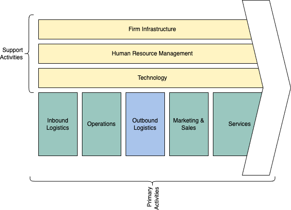

# Little People’s Architecture Vision: 


<details> 
<summary><b>Introduction:</b></br>This section introduces the purpose, scope, context, and stakeholders of the document. It explains why Little People needs an enterprise architecture vision and how it will benefit from it. </summary>

## 1. Introduction
This document outlines our vision for the future state of our enterprise architecture, using TOGAF methodologies. Our goal is to develop a holistic approach to achieve our business strategy, improve business processes and information, and reduce IT costs. We have chosen ArchiMate as our enterprise architecture modeling language because of its portability, flexibility, documentation, and community support. In this document, we will describe our current state, future state, and transition plan for our enterprise architecture. We hope that this document will provide a clear and consistent view of our architecture vision and ultimately help us achieve our goals. 
### 1.1. Purpose of the document
The purpose of this document is to present Little People’s architecture vision, which is a high-level description of the desired future state of our enterprise architecture. This document will explain how Little People plans to use ArchiMate, a portable and flexible framework for enterprise architecture modeling, to support their business strategy and address their challenges. This document will also provide a detailed overview of Little People’s current state, future state, and transition plan for their enterprise architecture, following the TOGAF methodology. This document is intended for the following audiences:

- **Management and staff of Little People**: Authorised personell responsible for providing high-quality care and education to young children.
- **Parents/guadians of Little People’s children**: Authorised personell interested in the communication and collaboration with Little People regarding the care and education of their children.
- **IT professionals and consultants**:  Authorised personell involved in the design, implementation, and governance of Little People’s enterprise architecture.
- **Regulators and auditors**: Authorised personell who need to ensure that Little People complies with the relevant standards and regulations.

This document will help these audiences understand the vision, goals, benefits, and roadmap of Little People’s enterprise architecture. It will also help them communicate and collaborate effectively with each other and with external stakeholders. This document will serve as a guide and a reference for the ongoing development and management of Little People’s enterprise architecture.

### 1.2. Scope and context
The scope of this document is to present Little People’s architecture vision, which is a high-level description of the desired future state of their enterprise architecture. This document will cover the key components and relationships of Little People’s enterprise architecture, including their business processes, information systems, and technology infrastructure. It will also describe how Little People plans to use ArchiMate, a portable and flexible framework for enterprise architecture modeling, to support their business strategy and address their challenges.

The context of this document is Little People’s current situation and challenges. Little People is a child care organization with 10 schools that provide care and education to young children. The organization is committed to providing high-quality care and education, but it is facing some challenges. One challenge is that it has a lot of administrative tasks that take up a lot of time and resources. Another challenge is that it wants to improve the communication with parents and the learning experience for children. Adopting an Enterprise Architecture allowed Little People to develop relevant processes, analysis, and documentation to ensure the alignment of information systems to their business goals and objectives. This allowed them to develop a holistic approach to achieve their business strategy, improve business processes and information, and reduce IT costs.
### 1.3. Stakeholders and concerns
The stakeholders of Little People’s enterprise architecture are the individuals or groups who have an interest or influence in the organization’s architecture. They include the following:

- **Management and Staff**: The management and staff of Little People are responsible for providing high-quality care and education to young children. They are concerned about the efficiency and effectiveness of their business processes, the quality and security of their information systems, and the innovation and growth of their organization.
- **Guardians**: The guardians of Little People’s children are interested in the communication and collaboration with Little People. They are concerned about the safety and well-being of their children, the transparency and accessibility of their information, and the satisfaction and loyalty of their relationship.
- **IT Professionals and Consultants**: The IT professionals and consultants who are involved in the design, implementation, and governance of Little People’s enterprise architecture. They are concerned about the alignment and integration of their information systems, the compliance and standards of their technology infrastructure, and the performance and scalability of their solutions.
- **Regulators and Auditors**: The regulators and auditors who need to ensure that Little People complies with the relevant standards and regulations. They are concerned about the legality and ethics of Little People’s business practices, the accuracy and reliability of Little People’s information, and the accountability and auditability of Little People’s operations.

These are some of the main stakeholders and concerns of Little People’s enterprise architecture. Each stakeholder group has its own unique perspective on the organization’s architecture, as well as its own set of concerns that need to be addressed. By understanding these stakeholders and their concerns, Little People can develop an enterprise architecture that meets their needs while also achieving its business goals.
</details>

<details> 
<summary><b>Architecture Vision:</b></br>This section describes the overall vision for the enterprise architecture, including the goals and objectives that the architecture is intended to achieve. It also outlines how the architecture will support the business strategy and address the stakeholder concerns.</summary>


## 2. Architecture Vision 

### 2.1 Stakeholder Map Matrix </h3>
Table 1, the stakeholder map matrix table, provides a high-level overview of the stakeholders of Little People’s enterprise architecture and their involvement, class, and relevant artifacts. It can be used to identify the key stakeholders and their concerns, as well as to plan and prioritize the communication and collaboration with them. the Stakeholder column lists the main stakeholders of Little People’s enterprise architecture. The Involvement column indicates the level of involvement that each stakeholder has in the organization’s architecture. The Class column indicates whether the stakeholder is internal or external to the organization. The Relevant Artifacts column lists the architecture artifacts that are relevant to each stakeholder.

**Table 1: Stakeholder Map Matrix**
| Stakeholder          | Involvement | Class | Relevant Artifacts |
| -------------------- | ----------- | ----- | ------------------ |
| Management and Staff | High |	Internal | Business Architecture, Information Systems Architecture, Technology Architecture |
| Parents | High | External | Business Architecture, Information Systems Architecture |
| IT Professionals and Consultants | Medium | External | Information Systems Architecture, Technology Architecture |
| Regulators and Auditors | Low | External | Business Architecture, Information Systems Architecture, Technology Architecture |

This stakeholder map matrix table provides a high-level overview of the stakeholders of Little People’s enterprise architecture and their involvement, class, and relevant artifacts. It can be used to identify the key stakeholders and their concerns, as well as to plan and prioritize the communication and collaboration with them.

### 2.2 Value Chain Diagram
The value chain for Little People Child Care is represented as a series of interconnected functions that add value to the organization’s services. The Inbound Logistics function represents the activities involved in receiving, storing, and distributing the inputs to the organization’s services, such as supplies, materials, and equipment. The Operations function represents the activities involved in transforming the inputs into the final services, such as providing care and education to young children. The Outbound Logistics function represents the activities involved in delivering the final services to customers, such as providing reports and updates to parents. The Marketing & Sales function represents the activities involved in promoting and selling the organization’s services, such as advertising and enrollment. The Service function represents the activities involved in supporting and enhancing the organization’s services, such as providing customer support and feedback.

**Daigram 1: Little People Value Chain**

**Daigram 2: Little People Value Chain**


**Diagram 1** value chain diagram shows how Little People Child Care creates value by performing a series of interconnected activities that transform inputs into valuable outputs. It also shows how each function contributes to the overall value of the organization’s services.

### 2.2. Business objectives and requirements
The business objectives and requirements for Little People’s enterprise architecture are based on the organization’s mission, vision, values, and goals. They reflect the main problems or challenges that Little People wants to solve or address with its enterprise architecture, as well as the expected benefits and outcomes of having a coherent and consistent enterprise architecture.

The following are some of the key business objectives and requirements for Little People’s enterprise architecture:

- **Enhance the learning experience for children**: Little People wants to provide personalized learning plans and adaptive assessments for each child, based on their individual needs, preferences, and progress. This will help to improve the quality of care and education that Little People provides to young children.
- **Improve communication with parents**: Little People wants to provide real-time updates on each child’s development and well-being, and send personalized notifications to parents. This will help to improve the transparency and accessibility of information, and increase the satisfaction and loyalty of parents.
- **Streamline administrative tasks** : Little People wants to automate administrative tasks such as scheduling, billing, and inventory management, and reduce manual errors and costs. This will help to improve the efficiency and effectiveness of Little People’s business processes.
- **Comply with standards and regulations**: Little People wants to ensure that its enterprise architecture complies with the relevant standards and regulations for child care and education. This will help to maintain the legality and ethics of Little People’s business practices.
- **Leverage existing technology infrastructure**: Little People wants to leverage its existing technology infrastructure and data sources, and integrate them with new AI solutions. This will help to maximize the return on investment and minimize the total cost of ownership of Little People’s enterprise architecture.

These business objectives and requirements provide a clear and concise statement of what Little People wants to achieve with its enterprise architecture. They serve as a guide and a reference for the subsequent phases of the TOGAF ADM process. They also help to communicate and collaborate effectively with the stakeholders and obtain their approval to proceed.
### 2.2. Architecture principles and constraints
### 2.3. Architecture vision statement
</details>

<details>
<summary><b>Baseline Description:</b></br>This section describes the current state of Little People’s enterprise architecture, using ArchiMate diagrams to model the existing business processes, information systems, and technology infrastructure. It also uses ArchiMate viewpoints to focus on specific aspects or perspectives of the enterprise architecture.</summary>

## 3. Baseline Description
### 3.1. Business architecture
### 3.2. Information systems architecture
### 3.3. Data architecture
### 3.4. Application architecture
### 3.5. Technology architecture
</details>

<details>
<summary><b>Target Description:</b></br>This section describes the future state of Little People’s enterprise architecture, using ArchiMate diagrams to model how it wants to improve or change its business processes, information systems, and technology infrastructure with AI. It also uses ArchiMate viewpoints to show how the future state will address the stakeholder concerns and meet the business objectives and requirements.</summary>
## 4. Target Description
### 4.1. Business architecture
### 4.2. Information systems architecture
### 4.3. Data architecture
### 4.4. Application architecture
### 4.5. Technology architecture
</details>
<details>
<summary><b>Gap Analysis:</b></br>This section analyzes the gap between Little People’s current state and future state of its enterprise architecture, using ArchiMate diagrams to identify</summary>
## 5. Gap Analysis
### 5.1. Differences between baseline and target architectures
### 5.2. Dependencies, risks, and opportunities
</details>
<details>
<summary><b>Roadmap:</b></br></summary>
## 6. Roadmap
### 6.1. Implementation plan
### 6.2. Timeline and milestones
</details>
<details>
<summary><b>Conclusion:</b></br></summary>
7. ## Conclusion
- ### Summary of key points
- ### Next steps
<details>

<summary>Tips for collapsed sections</summary>

### You can add a header

You can add text within a collapsed section. 

You can add an image or a code block, too.

```ruby
   puts "Hello World"
```
<summary>Tips for collapsed sections</summary>

### You can add a header

You can add text within a collapsed section. 

You can add an image or a code block, too.

```ruby
   puts "Hello World"
```

</details>